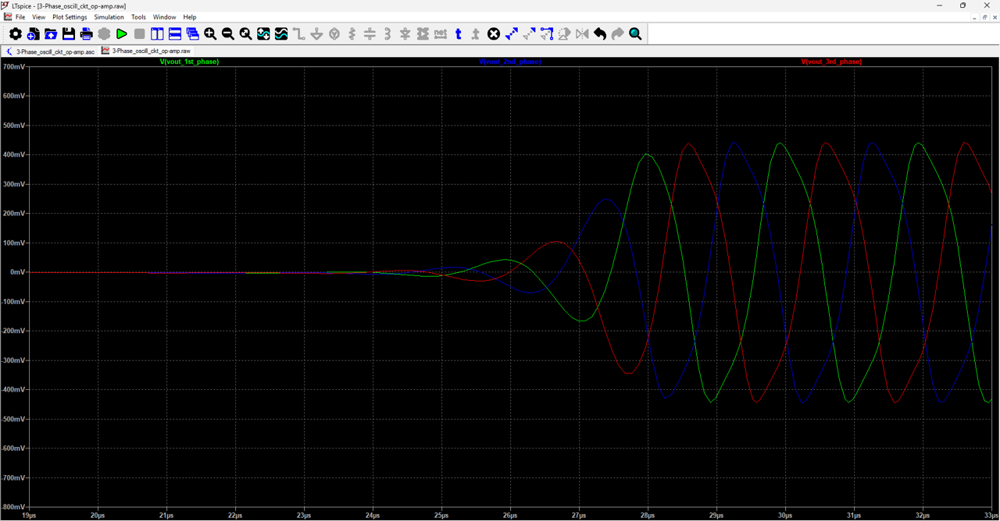
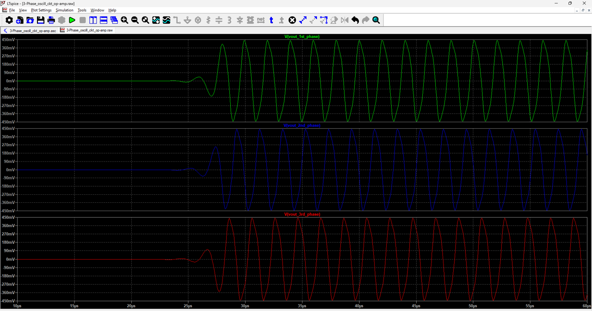
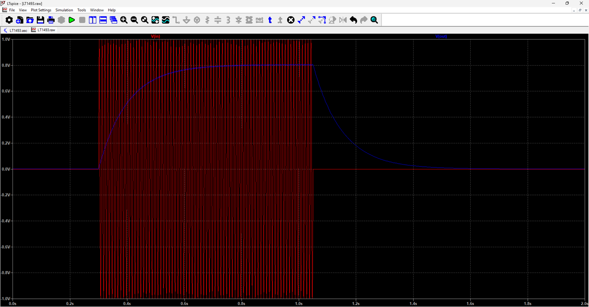
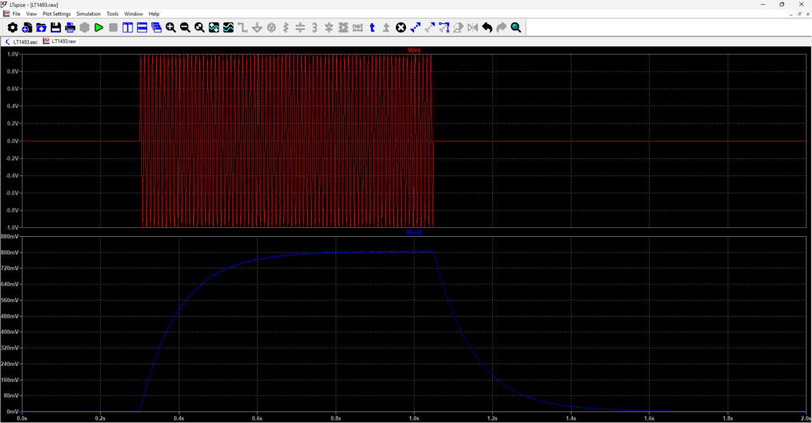
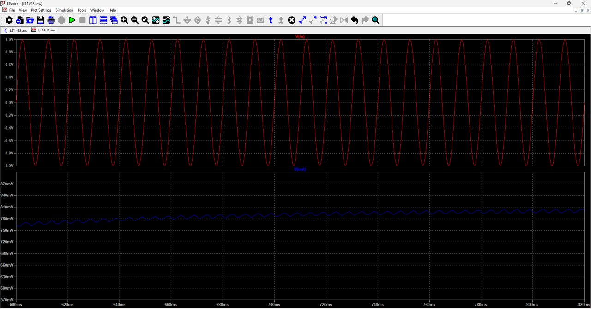

# 3-PHASE OSCILLATOR CIRCUIT USING LT1493 OP-AMP

## Overview

This project implements a **3-phase sinusoidal oscillator circuit** using three **LT1493 op-amps**, **RC feedback networks**, and **diode-limited amplitude control**. The oscillator generates **three sine waves** with **120° phase shift** between them, suitable for simulating 3-phase power systems and analog signal testing.

## Table of Contents

- [Project Objective](#project-objective)  
- [System Block Diagram](#system-block-diagram)  
- [Detailed Circuit Description](#detailed-circuit-description)  
  - [Phase 1: U1 – VOUT_1st_Phase](#phase-1-u1--vout_1st_phase)  
  - [Phase 2: U2 – VOUT_2nd_Phase](#phase-2-u2--vout_2nd_phase)  
  - [Phase 3: U3 – VOUT_3rd_Phase](#phase-3-u3--vout_3rd_phase)  
- [Mathematical Analysis and Component Selection](#mathematical-analysis-and-component-selection)  
- [Performance Highlights](#performance-highlights)  
- [Applications and Use Cases](#applications-and-use-cases)  
- [Conclusion](#conclusion)  
- [References](#references)  

## Project Objective

**To build a self-sustaining analog 3-phase oscillator using operational amplifiers and passive RC networks**, simulating three sinusoidal signals with 120° phase difference—ideal for testing and modeling 3-phase systems.

## Circuit Schematic

<strong>Figure 1: 3-Phase oscillator circuit using OP07 op-amp block diagram</strong>

## Detailed Circuit Description

### Phase 1: U1 – `VOUT_1st_Phase`
- Op-amp **U1** is configured as an **inverting amplifier**.  
- **Input signal** comes from the **output of U3**.  
- A **22kΩ resistor** and **100nF capacitor** set the **phase shift**.  
- A pair of **1N4148 diodes** and a **47kΩ resistor** are used to **clip the output** and **stabilize amplitude**.  

### Phase 2: U2 – `VOUT_2nd_Phase`
- **U2** takes input from `VOUT_1st_Phase`.  
- Another **22kΩ–100nF RC network** provides **60° additional phase shift**.  
- **Diode limiter** ensures the **waveform remains undistorted**.  

### Phase 3: U3 – `VOUT_3rd_Phase`
- **U3** receives the signal from `VOUT_2nd_Phase` and completes the **third 60° phase shift**.  
- Its **output is fed back to U1** to close the **oscillatory loop**.  
- **Similar RC and diode configuration** is used.

## Mathematical Analysis and Component Selection

- **RC Phase Shift per stage** = **60°**, so **3 stages** give **180°**.  
- **Op-amps introduce an additional 180°** due to **inversion**.  
- This results in a **complete 360° feedback loop**, satisfying the **Barkhausen criterion**.

### Frequency of Oscillation:

$$
f = \frac{1}{2\pi RC \sqrt{6}} = \frac{1}{2\pi \times 22k \times 100n \times \sqrt{6}} \approx 121\ \text{Hz}
$$

- **R = 22kΩ**  
- **C = 100nF**

<strong>Figure 2 : Output Waveform showing distinct 3 sinusoidal waves with different phases</strong>

## Circuit Performance 

- **Generates three sinusoidal signals at ~120 Hz.**  
- **Each output is 120° out of phase** with the others.  
- **Diode-based amplitude control** provides **stable output**.  
- **Oscillations begin automatically** due to the feedback loop.

## Applications and Use Cases

- **Simulation and testing** of **3-phase induction motors**.  
- **Study and analysis** of **3-phase power systems** in academics.  
- **Generation of low-frequency 3-phase reference signals** in analog environments.

### A Typical Application of LT1493 as a Precision AC to DC Converter(Full Wave Rectifier and Filter)

- In Stage 1, the LT1493 op-amp U1 is configured as a precision half-wave rectifier using resistors R1 (4.99kΩ), R2 (10kΩ), and R3 (15kΩ). The input AC signal from V3 is fed through a resistor divider (R1–R2) into U1, where negative halves are inverted and positive halves are passed linearly, resulting in a full-wave rectified signal at node N005 (due to the precision op-amp behavior without diodes).

- In Stage 2, op-amp U2, along with R4 (10kΩ), R5 (6.49kΩ), and R6 (10kΩ), performs summing and scaling of the rectified waveform. This sets the correct gain and removes any residual offset, ensuring the output at node OUT reflects the amplitude envelope of the original signal. 
  

- In Stage 3, capacitor C1 (10 µF) forms a low-pass filter with R6, smoothing the rectified waveform into a stable DC level by removing ripple and following the peak of the input. The resistors serve to set gain ratios, define feedback paths, and control time constants, while the capacitor ensures the output is clean with minimum ripples.

## Conclusion

**_This 3-phase oscillator design showcases how to produce phase-shifted sinusoidal signals using op-amp-based RC networks and diode amplitude stabilization. It is useful for analog simulations and educational demonstrations._**

## References

- **LT1493 (Op-Amp) Datasheet** – [LT1493 Datasheet](14923f.pdf)
- **1N4148 (Diode) Datasheet** – [1N4148 Datasheet](1N4148.PDF)    
- **Sedra & Smith**, *Microelectronic Circuits*  

